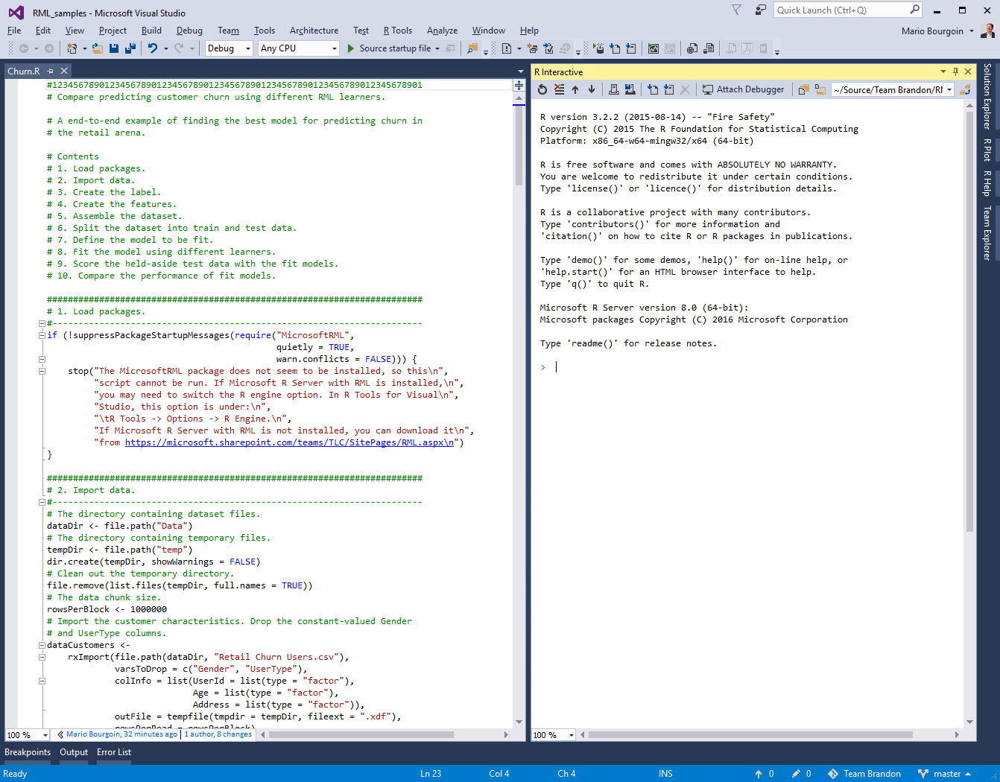
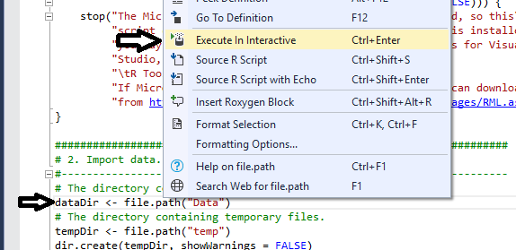
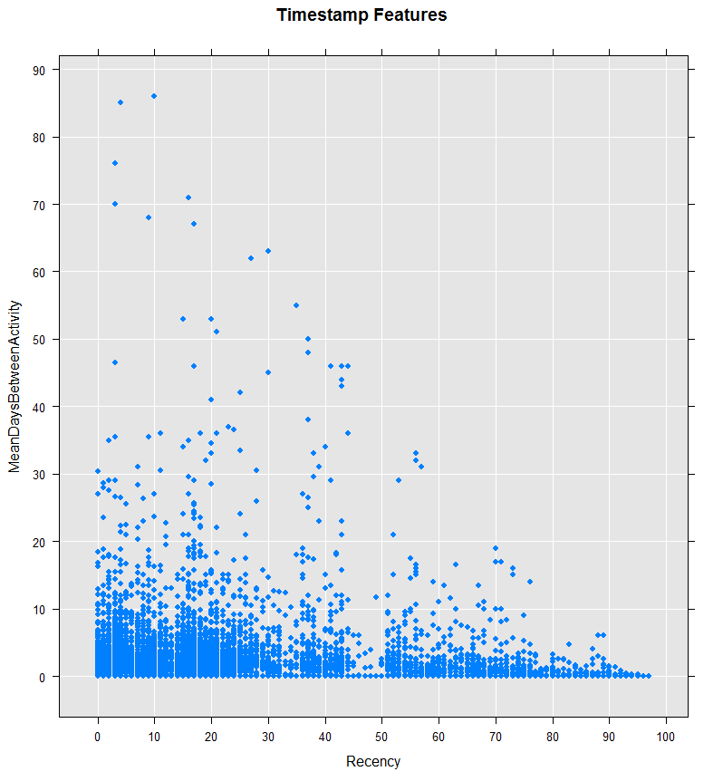
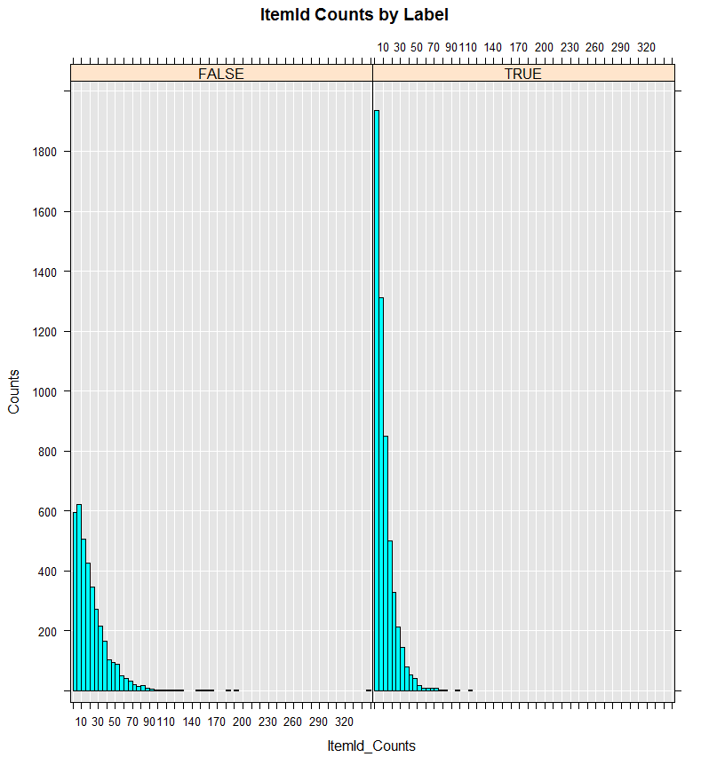
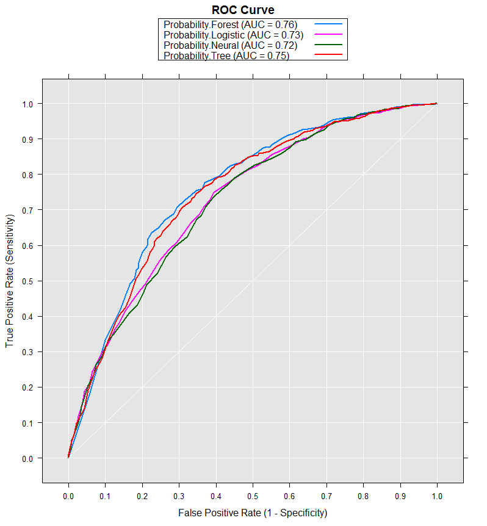

# Microsoft ML Retail Churn Tutorial

## Table of Contents

1. [Overview](#Overview)
2. [Setup for Interactive Tutorial](#Setup)
3. [Fitting Models that Predict Retail Churn](#Fitting)
4. [What's Next?](#Next)

## <a id="Overview">1. Overview</a>

Microsoft ML is an R package within Microsoft R Services that includes powerful machine learning algorithms and associated tools. The tutorial is an introduction to Microsoft ML for data scientists who want to take advantage of its unique capabilities.  It is intended primarily for those who are comfortable with using Microsoft R Services for data science, and want to see an end-to-end example that uses Microsoft ML to carry out common data science tasks.

The Microsoft ML tutorial is based on R scripts, and is intended to be interactive. Before you begin the tutorial, you should secure access to a Windows 10 system that includes the following:

  * Microsoft Visual Studio 2015 Update 3
  * R Tools for Visual Studio 0.5
  * Microsoft R Services 8.0.3
  * Microsoft ML 1.0.0

## <a id="Setup">2. Setup for Interactive Tutorial</a>

To set up Visual Studio for the interactive tutorial session, we recommend that you maximize the Visual Studio window, and set up its contents with two panes as is shown in [Figure 1](#Figure1). The pane on the right is named "R Interactive"; it is the R interpreter window, and shows the results of running R commands. The pane on the left is called a script pane, and shows an R script to be stepped through.



Interaction can be done through the mouse or keyboard. You can use the mouse to right click a command in the script, and select "Execute in Interactive" from the pop-up menu; in [Figure 2](#Figure2), the command "dataDir <- file.path("Data")" has been right-clicked, and "Execute in Interactive" has been selected. Then the command is shown and executed in the R Interactive pane. Alternatively, you can position the cursor on a command, and press Crtl+Enter to get the same result. To execute multiple lines at the same time, select the lines and then either right click the selection and select "Execute in Interactive" from the pop-up menu or press Crtl+Enter.



## <a id="Fitting">3. Fitting Models That Predict Retail Churn</a>

The tutorial steps through the fitting of a model for predicting retail churn. Customer churn is an expensive problem in retail, where a fraction of the current customers, the churners, stop patronizing a business, leading to a loss of business. We will focus on predicting which customers are likely to churn, and we will leave identifying how to keep customers from churning to other tutorials.

The tutorial begins from data imported from a retail database, goes through the creation of a label identifying customers who have churned and the creation of features based on customer purchase history, fits a model using multiple learning algorithms, and compares the performance of these fit models to select the best one. The initial and final steps in this process will be familiar to Microsoft R Services users, while the model fitting and performance evaluation steps will involve new Microsoft ML commands.

### <a id="Packages">3.1. Loading the Packages</a>

The tutorial is broken into steps, the first being loading the Microsoft ML package. Select the command in the first step, and execute it. You will see the text in the R Interactive pane, and there should be no other output.

### <a id="Import">3.2. Import Data</a>

The second step consists of importing the data we will use to fit a model. In our case, there are two tables of data: the customer table, indexed by a UserId, and the customer activity table, indexed by a TransactionId. This section imports the dataCustomers and dataActivity tables into Xdfs.

The dataCustomers table has one row per customer, and five columns: UserId, Age, Address, Gender, and UserType. Because Gender has the same value for all users, it is dropped; the same is true for UserType. The remaining three columns are factors.

The dataActivity table has one row per transaction, and nine columns: Column 0, TransactionId, Timestamp, UserId, ItemId, Location, and ProductCategory. Because Column 0 is the row number, it is dropped. And because Location and ProductCategory each have the same value for all users, they are dropped. Of the remaining six columns, three are factors: TransactionId, UserId, and ItemId, Timestamp is a date, and Quality and Value are numbers.

A key aspect of the import process consists in using the list of UserIds from the dataCustomers table to import the dataActivity table; this allows later table merges to be successful without additional work.

Select the commands in the second step, and execute them. Apart from seeing this text in the R Interactive pane, you will also likely see a running report of the data import process similar to the following:

```R
Rows Read: 10000, Total Rows Processed: 10000, Total Chunk Time: 0.031 seconds 
Rows Read: 252204, Total Rows Processed: 252204, Total Chunk Time: 1.281 seconds 
```

You can explore these newly loaded data by typing commands in the R Interactive pane. For example, you can view the first few rows of the customer table as follows:

```R
> head(dataCustomers)
   UserId Age Address
1 2105345   D       F
2 2085920   F       F
3 1976717   C       C
4  768535   A       E
5 1895117   D       F
6 1587807   J       E
```

And you can view the dimensions of the customer activity table as follows:

```R
> dim(dataActivity)
[1] 252204      6
```

### <a id="Label">3.3. Create the Label</a>

For a customer, the label shows whether or not they are expected to churn. We define a churner as a customer who will have fewer than churnThrehold transactions in the next 21 days, the churn period. Since the label is a prediction of the future, we can only use data known prior to the churn period to make the prediction. Then we must first split dataActivity table into two parts: the data from the 21 days of the churn period, and the data from before the start of the churn period.

We begin by getting the range of dates for which we have transaction data. Select the commands from "churnThreshold <- 0" through the "if (activityMax – activityMin …", and execute them. This will get the smallest and largest dates in the dataTransactions table. The last command verifies that we have transactions that cover at least twice as many days as the duration of the churn period. In the R Interactive pane, you will see a report similar to the following:

```R
Rows Read: 252204, Total Rows Processed: 252204, Total Chunk Time: 0.085 seconds 
Computation time: 0.185 seconds.
```

The date range is

```R
> activityMin
[1] "2000-11-01"
> activityMax
[1] "2001-02-28"
```

Next, we compute the start date of the churn period, and use it to split off dataActivity the transactions that happened before that date. Select the next two commands, and execute them, and you will see:

```R
Rows Read: 252204, Total Rows Processed: 252204, Total Chunk Time: 1.505 seconds 
```

We see that the new prechurnActivity table has fewer rows than the original dataActivity table:

```R
> nrow(dataActivity)
[1] 252204
> nrow(prechurnActivity)
[1] 205518
```

Now, we compute the total number of transactions for each customer and the number of transactions each customer had in prechurn period. The difference between these two quantities will be the number of transactions in the churn period for each customer. We merge those two tables by UserId so the quantities are side-by-side in one table. Select the next three commands, execute them, and you will see:

```R
Rows Read: 252204, Total Rows Processed: 252204, Total Chunk Time: 0.157 seconds 
Computation time: 0.254 seconds.
Rows Read: 205518, Total Rows Processed: 205518, Total Chunk Time: 0.138 seconds 
.
.
.
Number of rows written to file: 10000, Variable(s): UserId, Counts, Total number of rows in file: 10000
Time to sort data file: 0.154 seconds
Time to merge data file: 0.200 seconds
```

As we can check, the number of rows in activityCounts is 10,000 which is the number of customers:

```R
> nrow(prechurnActivity)
[1] 205518
> nrow(activityCounts)
[1] 10000
> head(activityCounts)
   UserId totalCounts prechurnCounts
1 2105345           8              8
2 2085920           4              1
3 1976717          39             39
4  768535          14             11
5 1895117          35             35
6 1587807          30             20
```

Finally, we compute the label by checking that the difference between the total and prechurn transactions is at most the churnThreshold. Select the next command, execute the selection, and you will see:

```R
Rows Read: 10000, Total Rows Processed: 10000, Total Chunk Time: 0.047 seconds 
```

As before, you can explore the newly created data by typing commands in the R Interactive pane. For example:

```R
> rxSummary(~ Label, dataLabel)
Rows Read: 10000, Total Rows Processed: 10000, Total Chunk Time: 0.004 seconds 
.
.
. 
 Name  Mean   StdDev    Min Max ValidObs MissingObs
 Label 0.5508 0.4974375 0   1   10000    0
```

Because "Label" is a logical value, its mean is the proportion of rows where "Label" is TRUE, so 55.08% of the customers have been identified as churners. This shows the data are reasonably balanced between the churners and non-churners. Note that we could have asked for a summary of all columns in the dataLabel table with the shorter command:

```R
> rxSummary(~ ., dataLabel) Do not run this command.
```

but the result would have needlessly taken tens of pages because one of the columns is the "UserId", a factor that is unique for each of the 10,000 rows.

### <a id="Features">3.4. Create the Features</a>

We use the prechurnActivity table to compute the activity-based features that will be used to predict churning. There are three kinds of data: dates, numbers, and factors, each of which produces its own kind of features for each customer.

The dates are used to compute the mean number of days between a customer's transactions, and the number of days from the last of the customer's transactions to the start of the churn period. Because the computation of the number of days between transactions cannot be done in a simple way using Xdfs, we first pull the dates into a data frame, do the computation, and import the results in an Xdf. Select the next two commands, execute the selection, and you will see:

```R
Rows Read: 205518, Total Rows Processed: 205518, Total Chunk Time: 0.100 seconds 
Rows Read: 9159, Total Rows Processed: 9159, Total Chunk Time: Less than .001 seconds 
```

When now ask for a summary of the new time-based features:

```R
> nrow(TimestampFeatures)
[1] 9159
> rxSummary(~ Recency + MeanDaysBetweenActivity, TimestampFeatures)
Rows Read: 9159, Total Rows Processed: 9159, Total Chunk Time: 0.005 seconds 
.
.
. 
 Name                    Mean      StdDev    Min Max ValidObs MissingObs
 Recency                 32.478873 27.967351 0   97  9159     0         
 MeanDaysBetweenActivity  2.224396  4.818434 0   86  9159     0         
```

The printout shows that this table has only 9,159 rows, which is below the 10,000 rows of the dataLabel column. We can also plot "MeanDaysBetweenActivity" v. "Recency":

```R
> rxLinePlot(MeanDaysBetweenActivity ~ Recency, TimestampFeatures, type = "p", title = "Timestamp Features")
Rows Read: 9159, Total Rows Processed: 9159, Total Chunk Time: 0.011 seconds 
```

The results shown in [Figure 3](#Figure3) let us see that as Recency increases, the range of MeanDaysBetweenActivity decreases, which is reasonable.



The numbers are Quantity and Value, and are used to compute totals and standard deviations. Because the standard deviation will be undefined for customers with only one transaction, we then replace the missing values in the data with zeros. Select the next four commands, execute the selection, and you will see:

```R
Rows Read: 205518, Total Rows Processed: 205518, Total Chunk Time: 0.122 seconds 
.
.
.
Rows Read: 10000, Total Rows Processed: 10000, Total Chunk Time: 0.054 seconds 
```

We may peek at the Quantity-based features:

```R
> head(QuantityFeatures)
   UserId Quantity_StdDev Quantity_Sum
1 2105345       0.3535534            9
2 2085920       0.0000000            5
3 1976717       1.9673447           72
4  768535       0.9244163           15
5 1895117       0.4528157           41
6 1587807       2.5152168           54
```

The factors are TransactionId and ItemId, and are used to compute the number of unique factor levels. Because the prechurnActivityCounts table already counts the number of transactions, we don't need to compute it again. For ItemId, we first get the unique the UserId and ItemId pairs, and then compute the number of ItemIds per UserId. Select the next two commands, execute the selection, and you will see:

```R
Number of rows written to file: 144597, Variable(s): UserId, ItemId, Total number of rows in file: 144597
Time to sort data file: 0.693 seconds
Rows Read: 144597, Total Rows Processed: 144597, Total Chunk Time: 0.083 seconds 
Computation time: 0.101 seconds.
```

Next, we merge these three kinds of activity-based features into one table. Select the next four commands, execute the selection, and you will see:

```R
Number of rows written to file: 9159, Variable(s): UserId, Recency, MeanDaysBetweenActivity, Total number of rows in file: 9159
.
.
.
Number of rows written to file: 10000, Variable(s): UserId, Counts, Total number of rows in file: 10000
Time to sort data file: 0.138 seconds
Time to merge data file: 0.231 seconds
```

Finally, we compute ratios of the sum features from the numbers and the count features from the factors. Select the next command, execute the selection, and you will see:

```R
Rows Read: 9159, Total Rows Processed: 9159, Total Chunk Time: 0.047 seconds 
```

We see that the data features table has 9,159 rows. We can now look at these features:

```R
> head(dataFeatures)
   UserId Recency MeanDaysBetweenActivity Quantity_StdDev Quantity_Sum
1 2105345      38               0.0000000       0.3535534            9
2 2085920      84               0.0000000       0.0000000            5
3 1976717      16               0.3421053       1.9673447           72
4  768535      24               5.5000000       0.9244163           15
5 1895117       2               1.5000000       0.4528157           41
6 1587807      15               1.8947368       2.5152168           54
  Value_StdDev Value_Sum TransactionId_Counts ItemId_Counts
1     77.22127       773                    8             8
2      0.00000       400                    1             1
3    114.51878      4939                   39            30
4    143.78412      1754                   11            10
5     48.81861      2222                   35            28
6     75.05877      2123                   20            18
  Quantity_per_TransactionId Quantity_per_ItemId Value_per_TransactionId
1                   1.125000            1.125000                96.62500
2                   5.000000            5.000000               400.00000
3                   1.846154            2.400000               126.64103
4                   1.363636            1.500000               159.45455
5                   1.171429            1.464286                63.48571
6                   2.700000            3.000000               106.15000
  Value_per_ItemId
1         96.62500
2        400.00000
3        164.63333
4        175.40000
5         79.35714
6        117.94444
```

### <a id="Assemble">3.5. Assemble the Dataset</a>

We merge the dataCustomers, dataLabel, and dataFeatures tables to create the dataset that we will use for training and testing fit models. Select the commands in this section, execute the selection, and you will see:

```R
Number of rows written to file: 10000, Variable(s): UserId, Age, Address, Total number of rows in file: 10000
Time to sort data file: 0.147 seconds
.
.
.
Number of rows written to file: 10000, Variable(s): UserId, totalCounts, prechurnCounts, Label, Total number of rows in file: 10000
Time to sort data file: 0.131 seconds
Time to merge data file: 0.320 seconds
```

We can see the number of rows in the data set, and the list of its columns:

```R
> nrow(dataset)
[1] 9159
> names(dataset)
 [1] "UserId"                     "Age"                       
 [3] "Address"                    "Recency"                   
 [5] "MeanDaysBetweenActivity"    "Quantity_StdDev"           
 [7] "Quantity_Sum"               "Value_StdDev"              
 [9] "Value_Sum"                  "TransactionId_Counts"      
[11] "ItemId_Counts"              "Quantity_per_TransactionId"
[13] "Quantity_per_ItemId"        "Value_per_TransactionId"   
[15] "Value_per_ItemId"           "Label"                     
```

And we can histogram a continuous column by the Label column:

```R
> rxHistogram(~ ItemId_Counts | Label, dataset)
Rows Read: 9159, Total Rows Processed: 9159, Total Chunk Time: 0.011 seconds 
Computation time: 0.024 seconds.
```

The side-by-side histograms in [Figure 4](#Figure4) show that the non-churners on the left, the "FALSE", have a different distribution of counts than the churners on the right, the "TRUE".



### <a id="Split">3.6. Split the Dataset Into Train and Test</a>

The data are randomly split by row into training and testing datasets. The training data will be used by the learners to fit models, while the test data will be used as a fair measure the performance of the fit models. Because the split is randomized, we first set the random seed used by the randomizer to guarantee we will be able to reproduce our results at a later date. Select the commands in this section, execute the selection, and you will see:

```R
Rows Read: 9159, Total Rows Processed: 9159Rows Read: 7312, Total Rows Processed: 7312, Total Chunk Time: 0.056 seconds 
Rows Read: 1847, Total Rows Processed: 1847, Total Chunk Time: 0.046 seconds 
, Total Chunk Time: 0.679 seconds 
```

We can explore the distribution of "Label" in the train and test sets. Here we only show the commands and their relevant printouts:

```R
> rxSummary(~ Label, dataTrain)
Rows Read: 7319, Total Rows Processed: 7319, Total Chunk Time: 0.004 seconds 
.
.
.
 Name  Mean      StdDev    Min Max ValidObs MissingObs
 Label 0.6009018 0.4897465 0   1   7319     0         
 ```

```R
> rxSummary(~ Label, dataTest)
Rows Read: 1840, Total Rows Processed: 1840, Total Chunk Time: 0.003 seconds 
.
.
.
 Name  Mean      StdDev   Min Max ValidObs MissingObs
 Label 0.6032609 0.489354 0   1   1840     0         
```

We that train has 7,319 rows and is 60% churners, while test has 1,840 rows and is also 60% churners.

### <a id="Define">3.7. Define the Model</a>

The model is a formula that describes what column has the label, and what columns are to be used to predict the label. We get all column names from the dataset, and then exclude UserId, Label, and splitVar to get the list of predictor columns. Then we create a formula that says that Label is to be predicted by the predictor columns. Select the commands in this section, and execute the selection; there should be no output. If you type "model" in the R Interactive window, and press Enter, you will see:

```R
> model
Label ~ Age + Address + Recency + MeanDaysBetweenActivity + Quantity_StdDev + 
    Quantity_Sum + Value_StdDev + Value_Sum + TransactionId_Counts + 
    ItemId_Counts + Quantity_per_TransactionId + Quantity_per_ItemId + 
    Value_per_TransactionId + Value_per_ItemId
```

### <a id="Fit">3.8. Fit the Model</a>

The model will be fit by the four learners that can predict class data: logisticRegression, fastTrees, fastForest, and neuralNet. In the next section, each fit will be used to score the test data. The comments in this section give a glimpse of the kind of work done by each learner. Select the commands in this section, execute the selection, and you will see:

```R
Automatically adding a MinMax normalization transform, use 'norm=Warn' or 'norm=No' to turn this behavior off.
Beginning read for block: 1
Rows Read: 7319, Read Time: 0.01, Transform Time: 0
.
.
.
Estimated Post-training MeanError = 1.228227
___________________________________________________________________
Not training a calibrator because it is not needed.
Elapsed time: 00:00:03.0645978
```

### <a id="Score">3.9. Score the Test Data</a>

Each fit will be used to score the test data.  In order to plot together each fit's performance for convenient side-by-side comparison, we append each prediction column to the test dataset. This will also conveniently include the Label column with the predictions, so that the prediction performance can be computed. Note that when the test data are huge, scoring in this manner may not be possible, and then each prediction will have to be computed separately, and they can then be merged into one data table. Select the commands in this section, execute the selection, and you will see:

```R
Beginning read for block: 1
Rows Read: 1847, Read Time: 0.015, Transform Time: 0
Beginning read for block: 2
.
.
.
Elapsed time: 00:00:00.2761970
Finished writing 1847 rows.
Writing completed.
```

We see the number of rows in the results:

```R
> nrow(fitScores)
[1] 1840
```

This is the same as the number of rows in the test data.

### <a id="Compare">3.10. Compare the Fit Model Performance</a>

For each fit model, its predictions and the Label are used to compute an ROC curve for that fit. The curves will then be plotted side-by-side in a graph similar to the image in [Figure 5](#Figure5).



They are then used to compute the fit model AUCs, and these are used to select the best model. Select the commands in this section, execute the selection, and you will see:

```R
Fit model AUCs:
  Forest Logistic   Neural     Tree 
    0.76     0.73     0.72     0.75 
Best fit model AUC with Forest.
```

So the best fit model was obtained using fastForest.

## <a id="Next">4. What's Next?</a>

The Microsoft ML samples contain other scripts formatted to follow the steps used for retail churn. Try them out interactively, and learn about other Microsoft ML capabilities.
